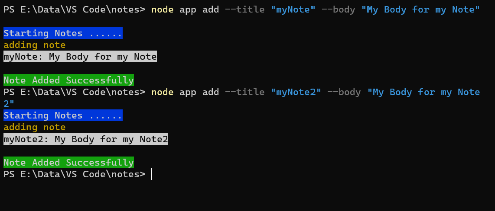
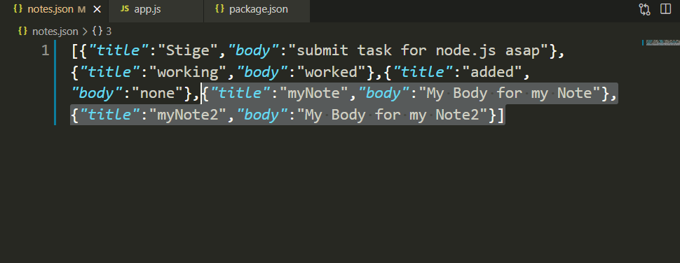
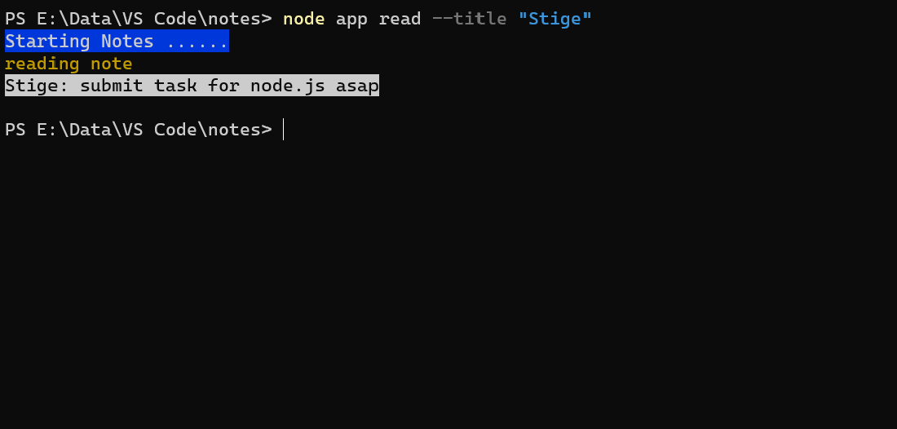
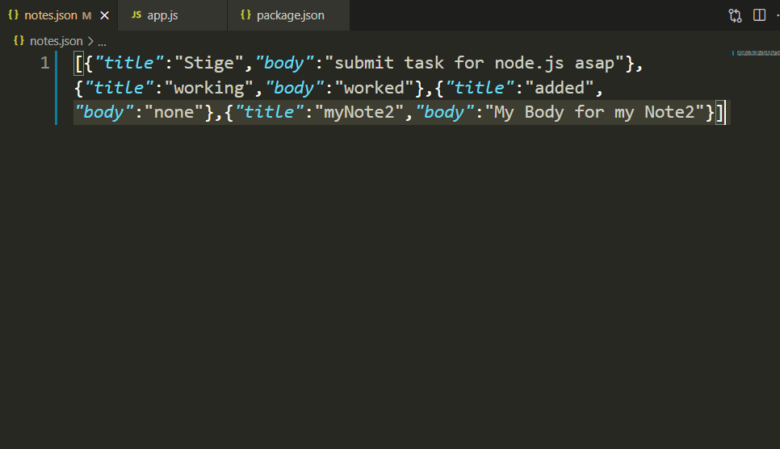
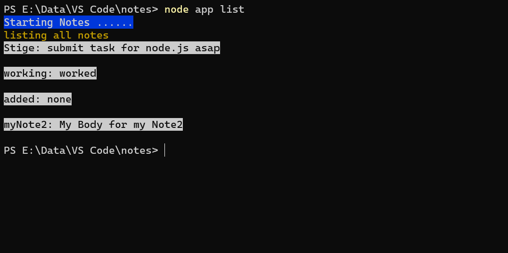
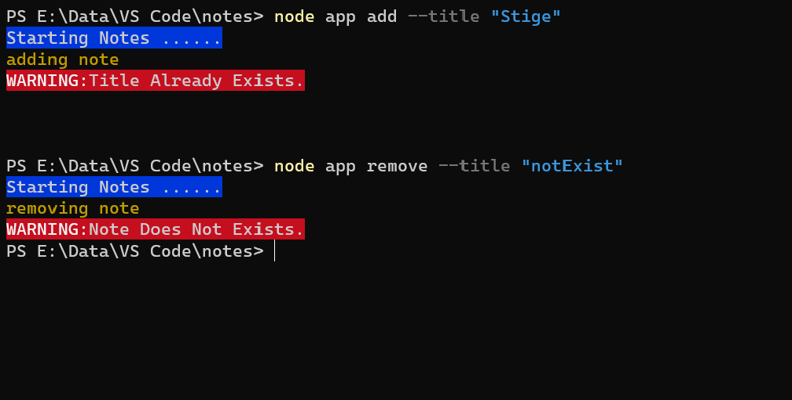

<h1 align="center">
# Simple Notes App Using NodeJS
</h1>

# Add note
- Requires user to enter Title and Body of the note and adds the note to our databse (json file)
- When user enters the commands to add two notes as shown in the add-note.png then two notes with the title and body as given in input are created in the notes.json file.

# Remove note
- Requires user to enter the Title of the note they want to remove and removes that note
- When user enters the command to remove a note as shown in the remove-note.png then it removes the note from the notes.json file.

# List notes 
- Lists the title of all the notes present
- When user enters the command to list the notes present as shown in list.png then it lists the titles of all the notes present.

# Read note 
- Requires user to enter the title of the note they want to read and displays the body of that note on the terminal
- When user enters the command to read a note as shown in read-note.png then it prints the body of that note. 

## Some additional feature
- If a user tries to add a note whose title is already taken then an error message in red should print on the terminal (“Title already taken!”)
- If a user tries to remove a note which doesn’t exists then an error message in red should print on the terminal (” Note not found!”)

## Tech-Stack used
- JavaScript 
- NodeJS
- **fs** module(to create a json file which will store the notes user enter and update it every time user wish to add or remove a note.
- **Yargs** module to take the input from the terminal and parse it from a string to an object of arguments.
- **Chalk** To print the output using different colors on the terminal.

## Author
👤 **RaHaT SaYYeD**
- Github: https://github.com/maleficscorpio
- Linkedin: https://www.linkedin.com/in/youreachedrahat
- Email: sayyedrahat721@outlook.com

# Show Your Support

Give a ⭐️ if you like this project!
